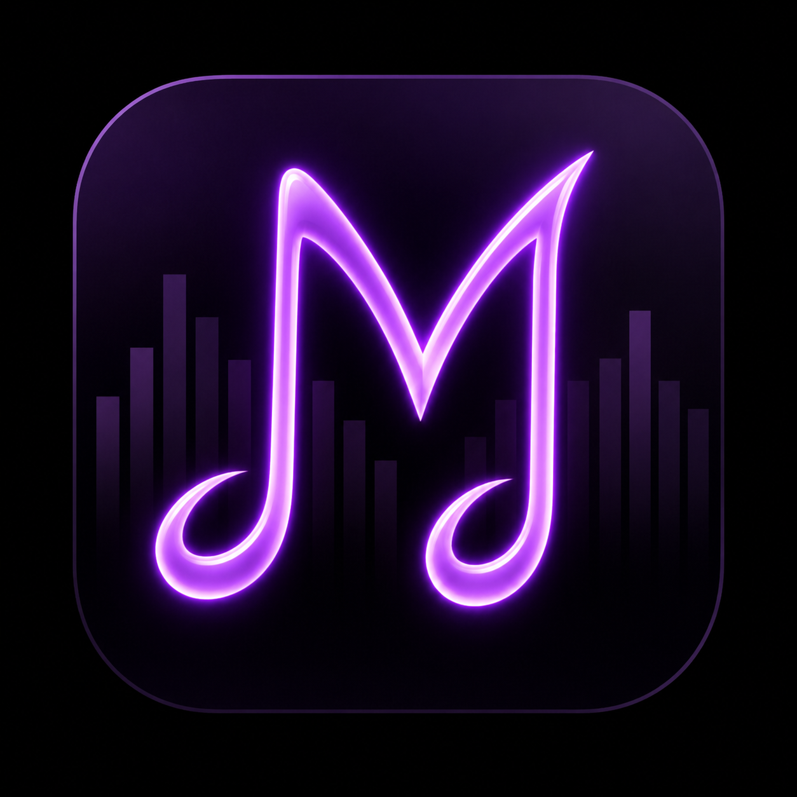
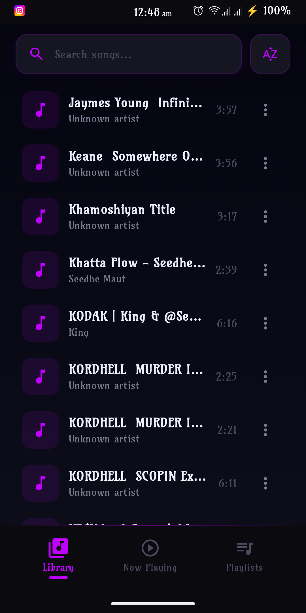
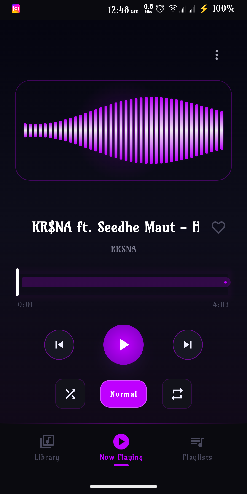
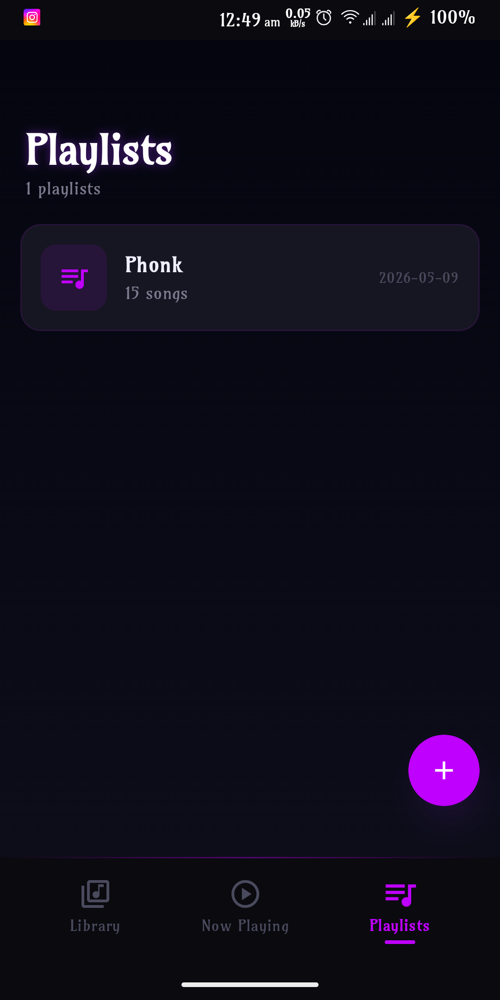
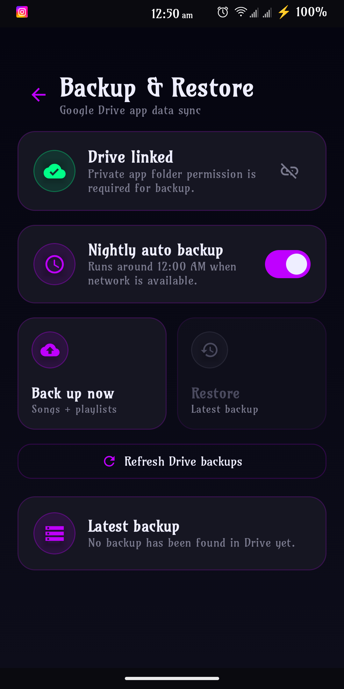
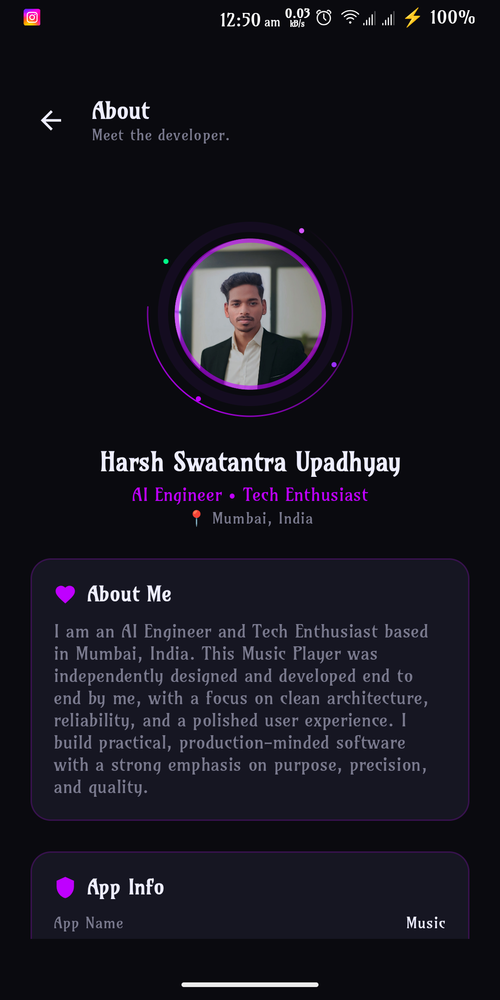

  
  <h1>Music by Iori Studios</h1>
  
<b>The ultimate, most beautiful, and revolutionary music player ever conceived.</b>

  
<i>Unprecedented performance. Mind-blowing UX. State-of-the-art aesthetics.</i>

---

## 🌟 The Philosophy: Why Build This?

*“If I can build my own, why use other apps?”*

In an era dominated by corporate giants, I am **tired of intrusive ads, constant data stealing, paywalls, and bloated software.** The modern mobile experience has become a nightmare of telemetry and subscriptions. 

This project was born out of a rebellion against that norm. I believe in **privacy, absolute control, and uncompromising aesthetics.** This app is built to bring power back to you, ensuring your music experience is strictly yours—completely free of corporate tracking, entirely offline-first, and designed with a breathtaking visual interface that outshines every mainstream alternative.

## 🚀 Mind-Blowing Features

- **Next-Generation UI/UX:** Built entirely with pure Jetpack Compose, featuring fluid micro-animations, glassmorphism, and a deeply immersive Material 3 dynamic design.
- **Flawless Local Playback:** Lightning-fast media scanning and playback that respects your device's battery and processing power.
- **Seamless Cloud Backup & Restore:** Securely backup your playlists and preferences to your personal Google Drive. Your data stays yours!
- **Interactive Reorderable Playlists:** Intuitive drag-and-drop mechanics to craft the perfect queue effortlessly.
- **Unrivaled Performance:** Engineered with an architecture that guarantees zero stuttering and instantaneous cold starts. 

## 📸 A Glimpse into Perfection

Prepare to be mesmerized. Here is a look at the unparalleled design of my application:

### 🏠 The Home Page

  

*A stunning, clean overview of your entire music library, dynamically adapting to your content.*

### 🎵 Currently Playing

  

*An immersive playback screen with buttery-smooth animations and striking album art presentation.*

### 📋 Playlist Management

  

*Organize your masterpieces with a sleek, drag-and-drop capable reorderable list.*

### ☁️ Backup & Restore

  

*A hyper-secure, one-tap gateway to sync your data with Google Drive.*

### 👨‍💻 About Developer

  

*The mind behind the magic at Iori Studios.*

## 🛠️ Cutting-Edge Technologies

This application isn't just an app; it's a showcase of the absolute best modern Android development has to offer:
- **Language:** 100% Kotlin
- **UI Toolkit:** Jetpack Compose (Material 3, Animations)
- **Architecture:** MVVM (Model-View-ViewModel) with Unidirectional Data Flow
- **Media Playback:** `androidx.media` for robust audio lifecycle management
- **Image Loading:** Coil for hyper-optimized image caching and rendering
- **Cloud Integration:** Google Play Services Auth & Google Drive API
- **Background Tasks:** Android WorkManager (`work-runtime-ktx`)
- **Navigation:** Compose Navigation (`navigation-compose`)
- **Advanced UI Components:** `sh.calvin.reorderable` for interactive drag-and-drop lists

---

## 🔐 Setting up Google Console OAuth Credentials

### Why do you need this?
To provide the flawless **Google Drive Backup & Restore** functionality without routing your data through a sketchy third-party server, the app connects *directly* to your personal Google Drive. 

Because of Google's strict security policies, you must provide your own OAuth 2.0 Client Credentials. This proves to Google that your local build of the app is authorized to request access to the Drive API on your behalf. **No middleman, no data harvesting—just pure, secure, direct communication.**

### Step-by-Step Guide

1. **Access Google Cloud Console:**
   Go to the [Google Cloud Console](https://console.cloud.google.com/) and sign in with your Google account.
2. **Create a New Project:**
   Click the project drop-down at the top, select **New Project**, name it something glorious like `My Ultimate Music Player`, and hit Create.
3. **Enable Google Drive API:**
   Navigate to **APIs & Services > Library**. Search for **Google Drive API** and click **Enable**.
4. **Configure the OAuth Consent Screen:**
   - Go to **APIs & Services > OAuth consent screen**.
   - Choose **External** (or Internal if you have a Google Workspace) and click Create.
   - Fill in the required app information (App name, support email, developer contact).
   - Under **Scopes**, you don't necessarily need to add scopes here, but if prompted, add `../auth/drive.file` or `../auth/drive.appdata`.
   - Add your own Google email under **Test users** so you can log in during development. Save and continue.
5. **Create Credentials:**
   - Go to **APIs & Services > Credentials**.
   - Click **+ CREATE CREDENTIALS** and select **OAuth client ID**.
6. **Configure the Application Type:**
   - Choose **Android** as the Application type.
   - Enter the Package name: `com.ioristudios.music`.
   - You will need your **SHA-1 certificate fingerprint**. You can get this by running `./gradlew signingReport` in the root of this project terminal. Copy the SHA-1 hash for the `debug` variant and paste it in the console.
   - Click **Create**.
7. **Alternative: Desktop/Web Client ID (If required for JSON config):**
   - If you need the `google-oauth.json` file as seen in the project root, create another OAuth Client ID, this time selecting **Desktop app** (or Web App). 
   - Click **Download JSON**, rename it to `google-oauth.json`, and place it exactly in the root directory of this project. 
   - *Note: Android typically uses the SHA-1 authentication automatically via Play Services, but the JSON is used if a custom backend/script is handling token exchange.*

## 🚀 How to Run Locally

1. Clone this repository to your local machine.
2. Open the project in **Android Studio (Ladybug or latest)**.
3. Ensure your `google-oauth.json` is properly placed in the root directory (if using custom auth flows) and your SHA-1 is registered in the Google Cloud Console.
4. Let Gradle sync its magic.
5. Hit **Run (Shift + F10)** and witness the future of music players!

---

  
Built with ❤️ and a blazing defiance against mediocre software.

